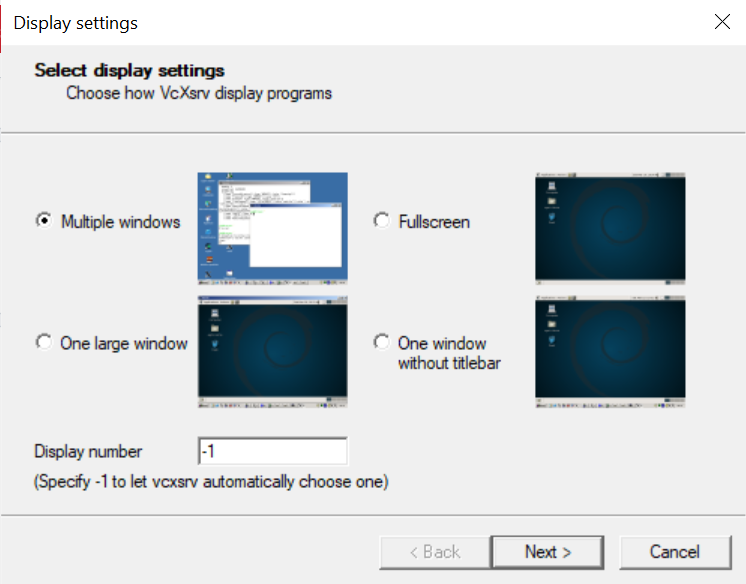
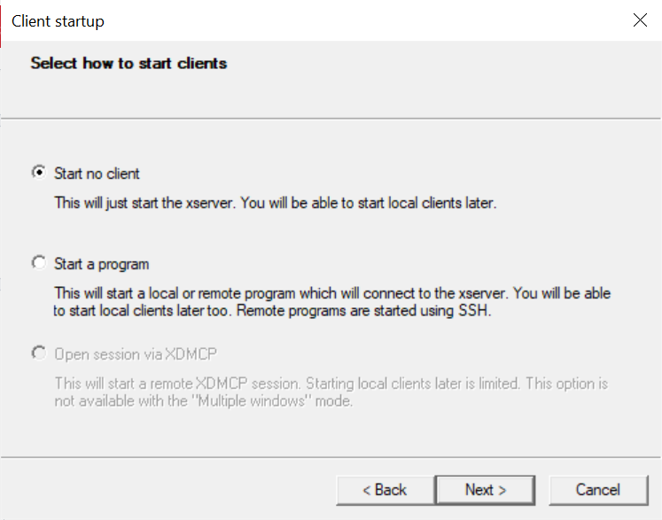
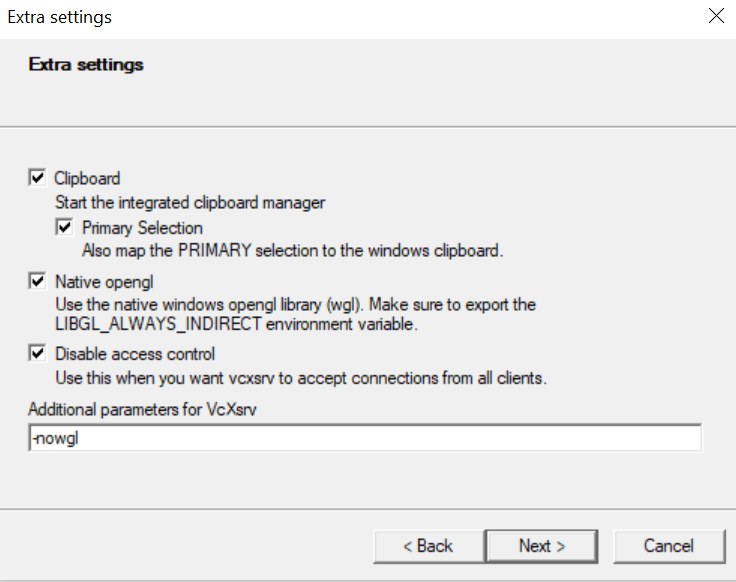
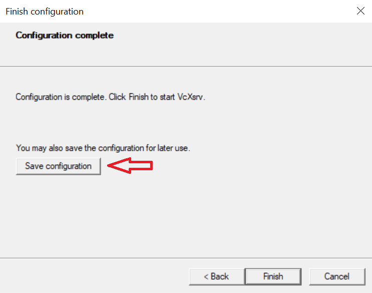

This guide explains the usage of AR-CVI component within the SHOP4CF EU project. 

AR-CVI is a component to display instructions for a human worker. The display can be either on a screen or by projecting to a surface. The communication is via ROS messages or via FIWARE Orion Context Broker (with Linked Data Extensions). 

# Installation of Orion-LD
In order to communicate using FIWARE messages, Orion-LD should be installed. The `RAMP-IoT-LD` folder contains `install.sh` script to install requirements and to start necessary containers with necessary networks set up.

The `uninstall.sh` script would remove all docker related files including images previously generated. Please check and modify it before using. 

```bash
sh RAMP-IoU-LD/install.sh
```

# Setting Config files
AR-CVI reads configuration information for FIWARE communication from a configuration file. The configuration file should be named as `arcvi-fiware-config.json`. The folder that contains the config file should be mounted to the `/configs` in the docker container. 

The configuration information is given below:

```json
{
    "projectName": "bos-uc1",
    "IP_fiware-orion-ld": "172.19.1.1"
}
```

`projectName` is a use-case specific name that will be read from the context id. The id is in `urn:ngsi-ld:Task:<projectName>:task<task_number>` format (An example: `urn:ngsi-ld:Task:bos-uc1:task0013`). 

`<task_number>` is not specifically read by AR-CVI, but it is to avoid any conflicts due to tasks published with the same id.

`IP_fiware-orion-ld` can be also specified as `auto`. In this case, the component will check `FIWARE_ORION_ID` environment variable, which is passed to the container with the `arcvi_run.sh` script. 

# Docker image
## <a name="docker_ubuntu"></a>Ubuntu
`arcvi_run.sh` starts the container and the AR-CVI component. AR-CVI is installed in `emecercelik/ar-cvi:ar-cvi_v1` image, which can be downloaded from docker hub with `docker pull emecercelik/ar-cvi:cvi_v1`.
 
`arcvi_run.sh` starts the container ensuring the following setup:
 
```bash
configs=<Path to the folder where configuration files are kept in HOST>
templates=<Path to the folder where AR-CVI projection templates are kept in HOST>
FIWARE_ORION_ID=$(docker inspect -f '{{range.NetworkSettings.Networks}}{{.IPAddress}}{{end}}' fiware-orion-ld)

xhost local:root
docker run -it --rm 	-v $configs:/configs \
			-v $templates:/templates\
			--name ar-cvi \
			--net=ramp-iot-ld_default \
			--privileged \
			--env="DISPLAY" \
			--env="QT_X11_NO_MITSHM=1" \
			--env="FIWARE_ORION_ID=${FIWARE_ORION_ID}" \
			--volume="/tmp/.X11-unix:/tmp/.X11-unix:rw" \
			emecercelik/ar-cvi:ar-cvi_v1

xhost -local:root
```

`configs` host path should contain `arcvi-fiware-config.json` configuration file. The `$configs` should be mounted in `/configs` inside the container as indicated. `$templates` contains the json templates for AR-CVI to project pre-defined displays or instructions. The `$templates` host folder should be mounted in `/templates` inside the container as shown. The network bridge that the container connects to is indicated with `--net` flag. The `RAMP-IoU-LD/install.sh` script sets up `ramp-iot-ld_default` network. The AR-CVI can communicate using FIWARE messages through this network. `FIWARE_ORION_ID` environment variable is passed to the docker container to get fiware-orion-ld IP address and use it automatically while making `GET` requests.

`--privileged`, `--env="DISPLAY"`, `--env="QT_X11_NO_MITSHM=1"`, `--volume="/tmp/.X11-unix:/tmp/.X11-unix:rw"` tags and xhost commands are necessary for using screen with the docker container.
## Windows WSL 2
Please refer to [ref1](https://github.com/ros-visualization/rviz/issues/1522), [ref2](https://dev.to/darksmile92/run-gui-app-in-linux-docker-container-on-windows-host-4kde), and [ref3](http://marinerobotics.gtorg.gatech.edu/running-ros-with-gui-in-docker-using-windows-subsystem-for-linux-2-wsl2/) for the solutions explained below.
 
Please follow steps below to run AR-CVI on Windows WSL 2.

- [Windows 10 WSL 2 Installation](#install_wsl) 
- [Docker Desktop WSL 2 Backend Installation](#install_docker) 
- [VcXsrv Windows X Server Installation and Configuration](#install_xserver) 
- [Running AR-CVI on Windows WSL 2 for Ubuntu](#run_arcvi) 

### <a name="install_wsl"></a>Windows 10 WSL 2 Installation 
You can install WSL 2 by following the [documentation](https://docs.microsoft.com/en-us/windows/wsl/install) for the default Linux distribution, which is Ubuntu. Running AR-CVI is only tested with Ubuntu running under WSL 2. 
### <a name="install_docker"></a>Docker Desktop WSL 2 Backend Installation
Docker Desktop WSL 2 Backend can be installed by following this [documentation](https://docs.docker.com/desktop/windows/wsl/). The prerequisites in the document should be followed and the WSL 2 support must be checked when asked during the installation.
### <a name="install_xserver"></a>VcXsrv Windows X Server Installation and Configuration
The Windows X Server is required to be able to connect to the display. VcXsrv can be installed [here](https://sourceforge.net/projects/vcxsrv/) following the images below for the configuration. Also, the installation steps are similar to the steps given [here](https://dev.to/darksmile92/run-gui-app-in-linux-docker-container-on-windows-host-4kde) with a few vital differences. 









At the last step please save the configuration file in one of the following paths:

```bash
%appdata%\Xming
%userprofile%\Desktop
%userprofile%

``` 

### <a name="run_arcvi"></a> Running AR-CVI on Windows WSL 2 for Ubuntu
Similar to the [Ubuntu](#ubuntu_docker) version, you can create the necessary folders: `configs` and `templates`. 

Please run the following script or `arcvi_run_win.sh` to start AR-CVI. 

```bash
configs=<Path to the folder where configuration files are kept in HOST>
templates=<Path to the folder where AR-CVI projection templates are kept in HOST>
images=<Path to the folder where images given in templates are kept in the HOST machine>

FIWARE_ORION_ID=$(docker inspect -f '{{range.NetworkSettings.Networks}}{{.IPAddress}}{{end}}' fiware-orion-ld)

docker run -it --rm     -v $configs:/configs \
                        -v $templates:/templates\
                        -v $images:/images \
                        --name ar-cvi \
                        --net=ramp-iot-ld_default \
                        --privileged \
                        -e DISPLAY=host.docker.internal:0.0 -e LIBGL_ALWAYS_INDIRECT= \
                        --env="FIWARE_ORION_ID=${FIWARE_ORION_ID}" \
                        emecercelik/ar-cvi:ar-cvi_v1
``` 

# Message Format

AR-CVI message format is built on top of [SHOP4CF Task data model](https://shop4cf.github.io/data-models/task.html). All data models defined for SHOP4CF can be found [here](https://shop4cf.github.io/data-models/). 

There are 4 types of commands for AR-CVI:
<ol>
<li>Add: This command adds the given instructions to the displayed instructions on the screen. </li>
<li>Reset: This command resets the screen and displays the given instructions in a Reset message on a clear screen. </li>
<li>AddTemplate: Similar to Add, this commands adds the given instructions provided with a pre-defined json template.</li>
<li>ResetTemplate: Similar to Reset, this command clears the screen and displays the instructions provided with a pre-defined json template.</li>
</ol>

An example of AddTemplate message type can be seen in [ar-cvi_addtemplate_example.pdf](ar-cvi_addtemplate_example.pdf) pdf document. In this pdf, examples of AddTemplate message and the template are shown with their effects on the screen. 

## Instruction types

The supported instruction types are listed below:
<ol>
<li>Written instructions</li>
Written instruction is displayed at the bottom of the screen. Defined with`"instruction":"Written instruction to be displayed"`. 
<li>Boxes</li>
Rectangular shaped boxes defined with the properties below: 

```json
{
"position":["0.15","0.2","0.0"], 
"width":"0.01",
"height":"0.01",
"label":"Box3",
"fill_color":{"r":"0.7","g":"0.7","b":"0.7","a":"0.7"},
"border_color":{"r":"1.0","g":"1.0","b":"1.0","a":"1.0"}
}
```

`position` defines where the center of the box will be by `x`, `y`, and `z` values. Here `z` is invalid. `width` and `height` define size of the box. `label` provides a displayed label for the box. `fill_color` and `border_color` are the colors inside the box and at the border of the box. These are defined with `r`, `g`, `b`, `a` values as shown. 

It is possible to to define more than one box at a message. The dictionaries defining multiple boxes can be appended to a list. 

<li>Images</li>

Images can be also displayed. The image extension can be `.svg`, `.png`, and `.jpg`. As shown below, `position` defines its center in `x` and `y` directions, `width` and `height` define its size, and `path` shows where the image is. 

```json
{
"position":["-0.45","0.25","0.0"],
"width":"750.0",
"height":"1000.0",
"path":"/ros_files/coord.png"
}
```

More than one image can be defined at a time. Image dictionaries should be appended to a list in that case. 
<li>Points</li>

Points are circles displayed on the screen defined as seen below. `position` indicates center of the circle in 2D. `radius` defines the radius of the circle. `label` is the label of the circle that will be displayed as well. `fill_color` and `border_color` define colors inside the box and at the border. 

```json
{
"position":["0.3","0.2","0.0"],
"radius":"0.03",
"label":"Circle3",
"fill_color":{"r":"0.7","g":"0.7","b":"0.7","a":"0.7"},
"border_color":{"r":"1.0","g":"1.0","b":"1.0","a":"1.0"}
}
```

Multiple points can be defined by appending multiple point dictionaries to a list.

<li>Outcome buttons (User input)</li>
Outcome buttons are information buttons shown at the bottom of the screen.

```json
{
"name": "0-default", 
"type": "0", 
"id": "0"
}
```
`name` is the label shown on the button. `type` indicates the button type, which are default (gray color, type:0), info (blue color, type:1), success (green color, type:2), warn (orange color, type:3), and error (red color, type:4) with indicated colors. `id` is the id given to that button. 

When the button is pressed, a fiware message containing `name`, `type`, and `id` will be sent to the context broker. An example is given below:

```bash
curl -iX POST 'http://<fiware_ip>:1026/ngsi-ld/v1/entities' 
    -H 'Content-Type: application/ld+json' 
    -d '{"id": "urn:ngsi-ld:Task:<project_name>:arcvi_ui<task_id>,
         "type": "Task",
         "workParameters": {
             "type":"Property",
             "value": {"uiName":<button.name>,
                       "uiType":<button.type>, 
                       "uiId":<button.id>
                      }
                      },
         "outputParameters": {"type": "Property",
                              "value": {"materialsAlreadyTransported": 0,"percentageCompleted": 0},
                              "observedAt": "2020-12-01T11:23:19Z"},
         "@context": ["https://smartdatamodels.org/context.jsonld","https://raw.githubusercontent.com/shop4cf/data-models/master/docs/shop4cfcontext.jsonld"]
         }'
```

Subscribers to this Task model can read the message and use the message as a trigger checking the `uiName` attribute, which is defined while preparing the display Task messages above.
</ol>


## Add message example
```bash
curl -iX POST \
  'http://localhost:1026/ngsi-ld/v1/entities' \
  -H 'Content-Type: application/ld+json' \
  -d '{
    "id": "urn:ngsi-ld:Task:bos-uc1:task0017",
    "type": "Task",
    "workParameters": {
        "type": "Property",
        "value": {"type":"Add",
                   "instruction":"Written Instruction",
                            "boxes":[{
                            	"position":["0.35","0.2","0.0"], 
                            	"width":"0.01",
                            	"height":"0.01",
                            	"label":"Box1",
                            	"fill_color":{"r":"0.7","g":"0.7","b":"0.7","a":"0.7"},
                            	"border_color":{"r":"1.0","g":"1.0","b":"1.0","a":"1.0"}},
                            
                            	{
                            	"position":["0.15","0.4","0.0"],
                            	"width":"0.02",
                            	"height":"0.05",
                            	"label":"Box2",
                            	"fill_color":{"r":"0.7","g":"0.7","b":"0.7","a":"0.7"},
                            	"border_color":{"r":"1.0","g":"1.0","b":"1.0","a":"1.0"}}
                            	],
                            	
                            "images":[
                            	{
                            	"position":["-0.65","0.25","0.0"],
                            	"width":"750.0",
                            	"height":"1000.0",
                            	"path":"/ros_files/coord.png"},
                            	
                            	{
                            	"position":["-0.1","0.23","0.0"],
                            	"width":"100.0",
                            	"height":"100.0",
                            	"path":"/catkin_ws/src/tum_ros/tum_ar/tum_ar_window/images/shop4cf.svg"}
                            	],
                            	
                            "pois":[
                            	{
                            	"position":["0.6","0.5","0.0"],
                            	"radius":"0.02",
                            	"label":"Circle1",
                            	"fill_color":{"r":"0.7","g":"0.7","b":"0.7","a":"0.7"},
                            	"border_color":{"r":"1.0","g":"1.0","b":"1.0","a":"1.0"}},
                            	
                            	{
                            	"position":["0.4","-0.1","0.0"],
                            	"radius":"0.02",
                            	"label":"circle2",
                            	"fill_color":{"r":"0.7","g":"0.7","b":"0.7","a":"0.7"},
                            	"border_color":{"r":"1.0","g":"1.0","b":"1.0","a":"1.0"}}
                            	],
                            	
                            "outcomes":[
                            	{"name": "0-default", 
                            	"type": "0", 
                            	"id": "0"}, 
                            	{"name": "1-info",
                            	 "type": "1",
                            	  "id": "1"}
                            	]
             }
    },
    "outputParameters": {
        "type": "Property",
        "value": {
            "materialsAlreadyTransported": 0,
            "percentageCompleted": 0
        },
        "observedAt": "2020-12-01T11:23:19Z"
    },
    "@context": [
        "https://smartdatamodels.org/context.jsonld",
        "https://raw.githubusercontent.com/shop4cf/data-models/master/docs/shop4cfcontext.jsonld"
    ]
}'
```

## Reset message examples
```bash
curl -iX POST \
  'http://localhost:1026/ngsi-ld/v1/entities' \
  -H 'Content-Type: application/ld+json' \
  -d '{
    "id": "urn:ngsi-ld:Task:bos-uc1:task0028",
    "type": "Task",
    "workParameters": {
        "type": "Property",
        "value": {"type":"Reset",
                   "instruction":"Written Instruction 3",
                            "boxes":[
                            	{
                            	"position":["0.10","0.15","0.0"], 
                            	"width":"0.01",
                            	"height":"0.01",
                            	"label":"Box3",
                            	"fill_color":{"r":"0.7","g":"0.7","b":"0.7","a":"0.7"},
                            	"border_color":{"r":"1.0","g":"1.0","b":"1.0","a":"1.0"}},
                            
                            	{
                            	"position":["0.15","0.2","0.0"],
                            	"width":"0.02",
                            	"height":"0.05",
                            	"label":"Box4",
                            	"fill_color":{"r":"0.7","g":"0.7","b":"0.7","a":"0.7"},
                            	"border_color":{"r":"1.0","g":"1.0","b":"1.0","a":"1.0"}}
                            	],
                            	
                            "images":[
                            	{
                            	"position":["-0.4","0.2","0.0"],
                            	"width":"750.0",
                            	"height":"1000.0",
                            	"path":"/ros_files/coord.png"},
                            	
                            	{
                            	"position":["0.12","0.2","0.0"],
                            	"width":"100.0",
                            	"height":"100.0",
                            	"path":"/catkin_ws/src/tum_ros/tum_ar/tum_ar_window/images/shop4cf.svg"}
                            	],
                            	
                            "pois":[
                            	{
                            	"position":["0.3","0.2","0.0"],
                            	"radius":"0.03",
                            	"label":"Circle3",
                            	"fill_color":{"r":"0.7","g":"0.7","b":"0.7","a":"0.7"},
                            	"border_color":{"r":"1.0","g":"1.0","b":"1.0","a":"1.0"}},
                            	{
                            	"position":["0.5","-0.2","0.0"],
                            	"radius":"0.01",
                            	"label":"circle4",
                            	"fill_color":{"r":"0.7","g":"0.7","b":"0.7","a":"0.7"},
                            	"border_color":{"r":"1.0","g":"1.0","b":"1.0","a":"1.0"}}
                            	],
                            	
                            "outcomes":[
                            	{"name": "2-success", 
                            	"type": "2", 
                            	"id": "2"},
                            	{"name": "3-warn", 
                            	"type": "3", 
                            	"id": "3"}, 
                            	{"name": "4-error", 
                            	"type": "4", 
                            	"id": "4"}
                            	]
             }
    },
    "outputParameters": {
        "type": "Property",
        "value": {
            "materialsAlreadyTransported": 0,
            "percentageCompleted": 0
        },
        "observedAt": "2020-12-01T11:23:19Z"
    },
    "@context": [
        "https://smartdatamodels.org/context.jsonld",
        "https://raw.githubusercontent.com/shop4cf/data-models/master/docs/shop4cfcontext.jsonld"
    ]
}
```

```bash
curl -iX POST \
  'http://localhost:1026/ngsi-ld/v1/entities' \
  -H 'Content-Type: application/ld+json' \
  -d '{
    "id": "urn:ngsi-ld:Task:bos-uc1:task0003",
    "type": "Task",
    "workParameters": {
        "type": "Property",
        "value": {"type":"Reset"
                   
             }
    },
    "outputParameters": {
        "type": "Property",
        "value": {
            "materialsAlreadyTransported": 0,
            "percentageCompleted": 0
        },
        "observedAt": "2020-12-01T11:23:19Z"
    },
    "@context": [
        "https://smartdatamodels.org/context.jsonld",
        "https://raw.githubusercontent.com/shop4cf/data-models/master/docs/shop4cfcontext.jsonld"
    ]
}'
```

## AddTemplate message example
```bash
curl -iX POST \
  'http://localhost:1026/ngsi-ld/v1/entities' \
  -H 'Content-Type: application/ld+json' \
  -d '{
    "id": "urn:ngsi-ld:Task:bos-uc1:task0012",
    "type": "Task",
    "workParameters": {
        "type": "Property",
        "value": {"type":"AddTemplate",
                   "path":"/templates/temp3.json"
             }
    },
    "outputParameters": {
        "type": "Property",
        "value": {
            "materialsAlreadyTransported": 0,
            "percentageCompleted": 0
        },
        "observedAt": "2020-12-01T11:23:19Z"
    },
    "@context": [
        "https://smartdatamodels.org/context.jsonld",
        "https://raw.githubusercontent.com/shop4cf/data-models/master/docs/shop4cfcontext.jsonld"
    ]
}'
```

## ResetTemplate message example
```bash
curl -iX POST \
  'http://localhost:1026/ngsi-ld/v1/entities' \
  -H 'Content-Type: application/ld+json' \
  -d '{
    "id": "urn:ngsi-ld:Task:bos-uc1:task0011",
    "type": "Task",
    "workParameters": {
        "type": "Property",
        "value": {"type":"ResetTemplate",
                   "path":"/templates/temp2.json"
             }
    },
    "outputParameters": {
        "type": "Property",
        "value": {
            "materialsAlreadyTransported": 0,
            "percentageCompleted": 0
        },
        "observedAt": "2020-12-01T11:23:19Z"
    },
    "@context": [
        "https://smartdatamodels.org/context.jsonld",
        "https://raw.githubusercontent.com/shop4cf/data-models/master/docs/shop4cfcontext.jsonld"
    ]
}'

```

## Template explanation
Template is a json file that contains display instructions in a formatted way. An example can be seen below:
```json
{
    "instruction": "Template Instruction 1",
    "boxes": [
        {
            "position": [
                "0.15",
                "0.2",
                "0.0"
            ],
            "width": "0.01",
            "height": "0.01",
            "label": "TempBox1",
            "fill_color": {
                "r": "0.7",
                "g": "0.7",
                "b": "0.7",
                "a": "0.7"
            },
            "border_color": {
                "r": "1.0",
                "g": "1.0",
                "b": "1.0",
                "a": "1.0"
            }
        },
        {
            "position": [
                "0.15",
                "0.2",
                "0.0"
            ],
            "width": "0.02",
            "height": "0.05",
            "label": "TempBox2",
            "fill_color": {
                "r": "0.7",
                "g": "0.7",
                "b": "0.7",
                "a": "0.7"
            },
            "border_color": {
                "r": "1.0",
                "g": "1.0",
                "b": "1.0",
                "a": "1.0"
            }
        }
    ],
    "images": [
        {
            "position": [
                "-0.45",
                "0.25",
                "0.0"
            ],
            "width": "750.0",
            "height": "1000.0",
            "path": "/ros_files/coord.png"
        },
        {
            "position": [
                "0.1",
                "0.23",
                "0.0"
            ],
            "width": "100.0",
            "height": "100.0",
            "path": "/catkin_ws/src/tum_ros/tum_ar/tum_ar_window/images/shop4cf.svg"
        }
    ],
    "pois": [
        {
            "position": [
                "0.3",
                "0.2",
                "0.0"
            ],
            "radius": "0.03",
            "label": "Circle3",
            "fill_color": {
                "r": "0.7",
                "g": "0.7",
                "b": "0.7",
                "a": "0.7"
            },
            "border_color": {
                "r": "1.0",
                "g": "1.0",
                "b": "1.0",
                "a": "1.0"
            }
        },
        {
            "position": [
                "0.5",
                "-0.2",
                "0.0"
            ],
            "radius": "0.01",
            "label": "circle4",
            "fill_color": {
                "r": "0.7",
                "g": "0.7",
                "b": "0.7",
                "a": "0.7"
            },
            "border_color": {
                "r": "1.0",
                "g": "1.0",
                "b": "1.0",
                "a": "1.0"
            }
        }
    ],
    "outcomes": [
        {
            "name": "2-success",
            "type": "2",
            "id": "2"
        },
        {
            "name": "3-warn",
            "type": "3",
            "id": "3"
        },
        {
            "name": "4-error",
            "type": "4",
            "id": "4"
        }
    ]
}
```
